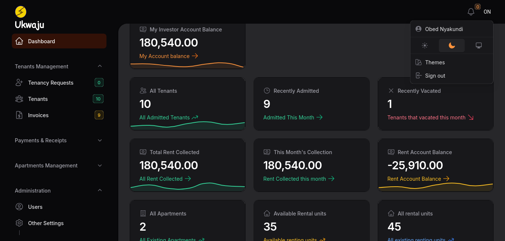

# A web-based Rental House Management System
This is a web application for Rental House Management. It was originally designed for use in administrative reccords management in 2018, and was open to the public in 2020. The original version utilized SMS for communication and MPESA for payment.

Much has changed since its design to enhance its stability, security and performance. Not withstanding the changes, I believe that it still gives a solid foundation to anybody who is interested in learning the good old PHP and its application. It has instances for both imperative and OOP.

If you wish test the system, you can click the link below:

#

# To easily login, paste the link below in yor browser
http://localhost/Rental-house-management-system-main


# Or the more stable Laravel version view...


developed under **[Benard kibet


# Included features
- a fancy landing page for display of vacant rooms/houses
- an administrator panel 
- a blog 
- a database

## Major Dependencies
**PHP Dependencies:**
- ~~fpdf~~ depricated. removed.
- ~~Africastalking~~ depricated. replaced with TextSMS
- ~~jGraph~~ depricated. removed.
- ~~php-Mpesa~~ depricated. replaced with daraja.

**CSS Dependencies**
- Bootstrap
- less
- Font awesome.
- W3.css

**JS dependencies**
- Bootstrap
- Hack
- jQuery navigation
- Fancy box
- Modernizer
- Ajax

# THE USER'S GUIDE
## HOW TO INSTALL:
 - Ensure you install XAMPP/WAMPP (or a relevant php host with MYSQL)
 - Create a table named `Company`
 - import the `Company.sql` file, from the `database` folder into your `PHPmyadmin` table `Company`
 - copy all the contents of folder containing the `index.php` file into your server.
 - open the file `admin/functions/db.pdf`
 - edit the details of the following to match your server connection details:
 ```
$host= 'YourHost';
$user='YourDatabaseUserName';
$usrpassword='YourDBPassword';
$database='YourDBName';

 ``` 
 - To enable sending SMS via the system, update the variables under:
 ```
$sms_apiKey = "YourAPIKey";
$sms_partnerID = "YourPartinerID";
$sms_shortcode = "TextSMS";
 ```
 - run the `index.php` file
 - run the `admin/` folder to login into the admin panel

## TO TEST:
Admin panel login credentials are:
 - USER NAME:  **ben12@gmail.com**
 - PASSWORD:   **mimi**


# License
This is the original app as was developed in 2018. A few changes have been made ever since its deployment to enhance its security, stability, and efficiency. Even then, we took care to retain the stability of this application. It's my hope that you will find this app fun to use and easy to improve. 

Feel free to use it as it will suit you. To receive a complete version of the software, please reach out to me via:

# Need further support?
Reach out for a stable version or support via:
Email: *benkibet553@gmail.com* or 
Tel:   *+254742448601


I wish you all the best as you explore this limited app!


# ...And With a New, Secure, Stable Version!
Our improved premium version is now out, developed in Laravel. It contains features for:

## General
- Adding apartments
- Adding rental units to apartments
- Admitting tenants to Rental units.
- Automated invoicing to tenats.
- Manual addition of payments (currently working on an android platform for unified automated payments)
- Printable payment receipts and invoices

## Administration
In the new version, the administrator can create custom roles for other users in the system. I.e, a landlord can create a role of a "caretaker" or "accountant" and assign appropriate roles.

## Marketing
We added
- Bulk SMS incorporated for marketing (utilizes TextSMS vendor at 0.3 KES per SMS text)
- A landing page that can display all vacant rooms with their pricing.
- Theme color changes for better visibility

